# Museum 3D

Developed a virtual museum with JavaScript and WebGL as a computer graphics class project in a team of 3. Cited by Professor Ridge at Web3D 2019 Conference as an example of “active textbook”. Implemented advanced graphics features such as SkyBox, Water, and Mouse Picking.

[Demo (Recommend Chrome Browser)](https://intro-graphics-master.github.io/term-project-8/)

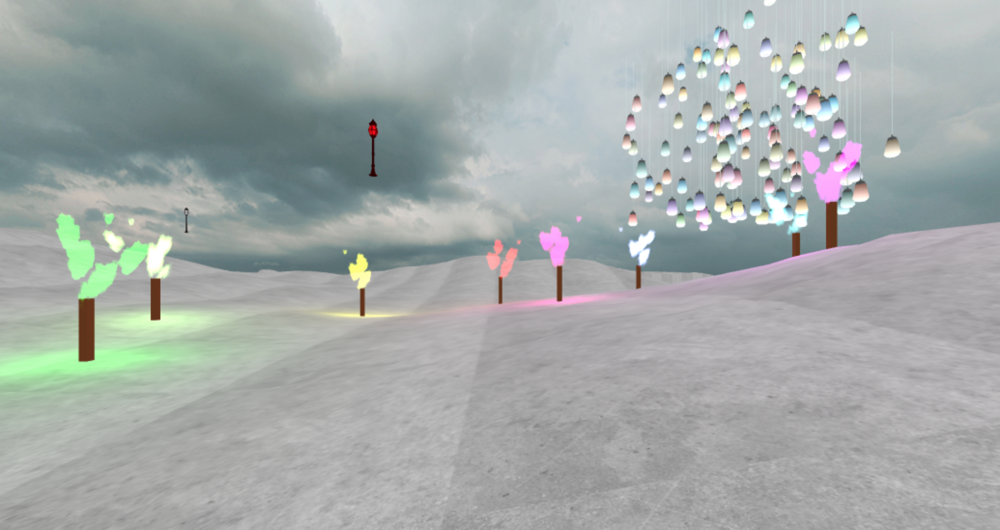

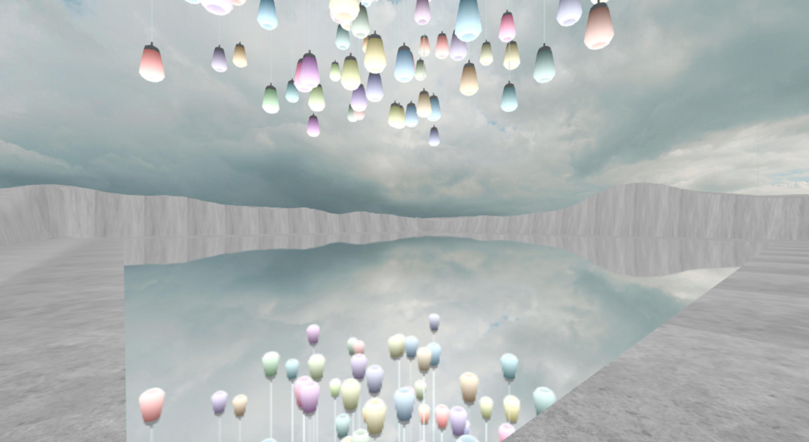

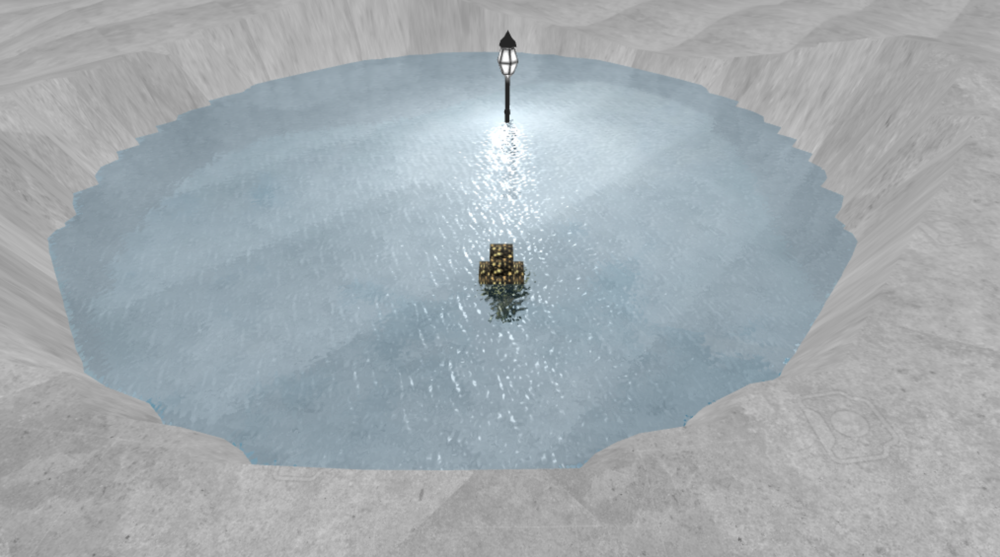

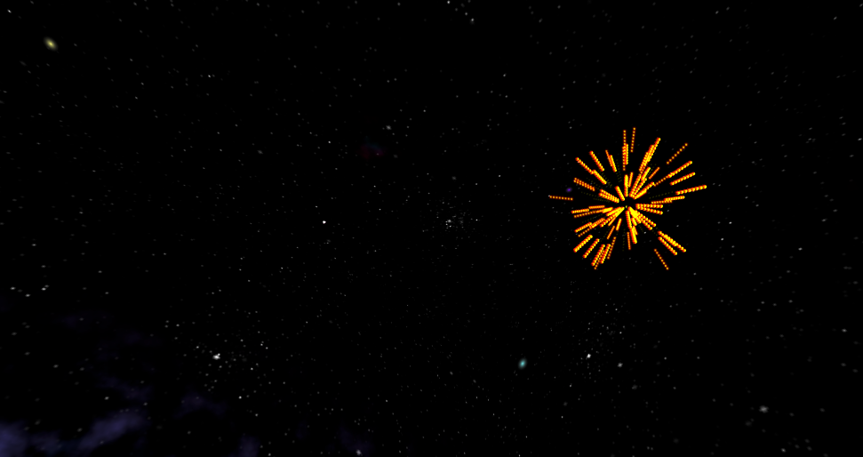

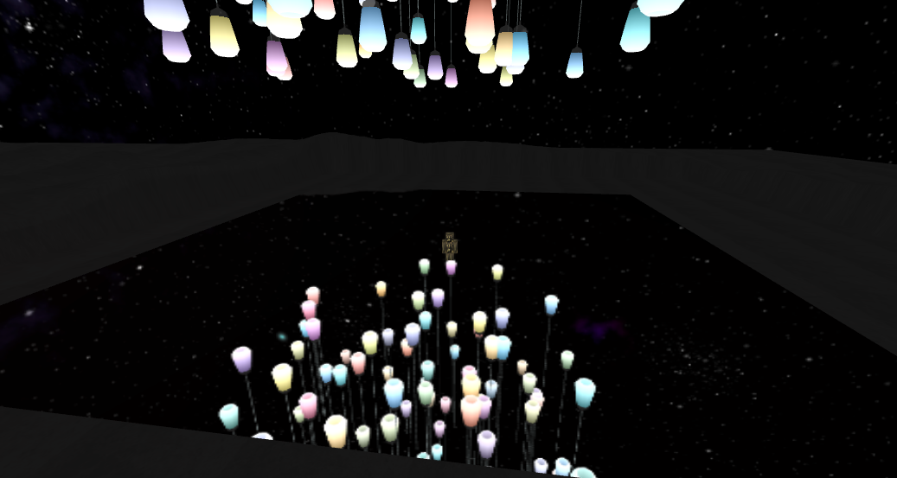

## Summary

### Non-obvious things implemented

For non-obvious things implemented, please checkout Advanced Graphics Features section below. The section has pretty much everything we implemented including obvious ones and non-obvious ones.

### Diffuculties

#### Junhong Wang

Everything was hard to be honest. The hardest one was water because I had to take care of reflection, refraction, and normal. It is very computationally expensive too, so I had to optimize the code so that it only draws the water if the player is close enough to the location of water.

#### Jonathan

The hardest part is proabbly creating the Particles System class,
since each particles must hold their own physcal properties
that determines its next potential positision and velocity.
the first build up Partical System Class often crashed or made 
the animation frame very slow. But with the help of Junhong, the 
System's preformance has a significant improvement.

#### John

Without using the surface of revolution, it's really hard to model the light bulb with a few shapes like sphere, square, donut,...

### Advanced topics used

For advanced topics used, please checkout Advanced Graphics Features section below. The section has pretty much everything we implemented including obvious ones and non-obvious ones.

### Teammates' contributions

#### Junhong Wang

- Skybox
- 1st / 3rd person view camera
- Water
- Minecraft person
- Mouse picking
- Terrain
- Mirror
- Torch (Particle System)

#### Jonathan

- Partical System 
- Partical 
- FireWork

#### John

- Light Bulb (Surface of Revolution)
- Lighting effect

## Introduction

We created an virtual museum with webGL. Inside the museum, there will be something visually pleasing implemented with advanced graphics features. As a player, you can walk into the museum, and see something like this.

This is from Teamlab museum in Tokyo. A player can also interact with the arts. For example, clicking one of the light bulb above changes the color of that light bulb.

## Advanced Graphics Features

Here’s the list of advanced graphics features we implemented

- [x] [Skybox](https://www.youtube.com/watch?v=_Ix5oN8eC1E&list=PLRIWtICgwaX0u7Rf9zkZhLoLuZVfUksDP&index=27)
- [x] 1st Person View Camera
- [x] [3rd Person View Camera](https://www.youtube.com/watch?v=PoxDDZmctnU&list=PLRIWtICgwaX0u7Rf9zkZhLoLuZVfUksDP&index=19&frags=pl%2Cwn>)
- [x] [Water](https://www.youtube.com/watch?v=HusvGeEDU_U&list=PLRIWtICgwaX23jiqVByUs0bqhnalNTNZh)
- [x] [Minecraft person](http://learningthreejs.com/blog/2012/07/05/minecraft-character-in-webgl/)
- [x] [Mouse Picking](https://www.youtube.com/watch?v=DLKN0jExRIM&list=PLRIWtICgwaX0u7Rf9zkZhLoLuZVfUksDP&index=29)
- [x] [Particle Effects](https://www.youtube.com/watch?v=6PkjU9LaDTQ&list=PLRIWtICgwaX0u7Rf9zkZhLoLuZVfUksDP&index=34)
- [x] Terrain
- [x] Mirror
- [x] Modeling Light Bulb
- [x] Particle Effects (Torch)

## Skybox

The idea of skybox is that we create a box with sky textures on it. Each side of the box has a corresponding texture (i.e. top, bottom, right, … etc)

The key point here is that we apply all the transformations just like any other objects in the world except we don't want to apply the translation of the camera. We want the sky to move with the player.

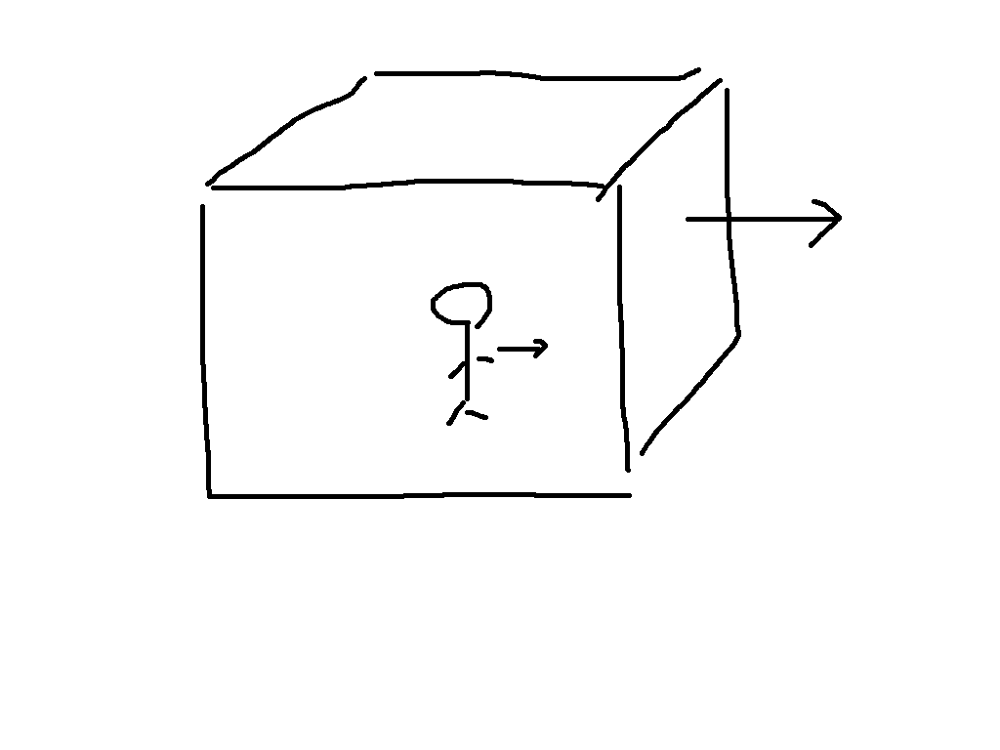

## 1st Person View Camera / 3rd Person View Camera

The original implementation of the camera always translate and rotate with respect to current orientation of the camera. We wanted the camera to behave similar to the way it works in First Person View Shooting Game (e.g. COD).

## Minecraft Person

It works just like the dragonfly assignment.

## Terrain

Terrain is made of bunch of squares.

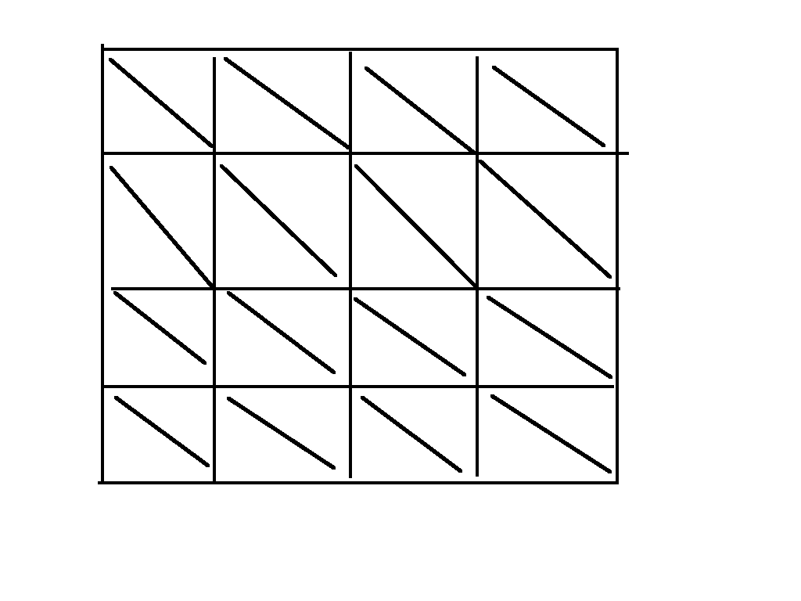

Then we can height map to assign heights to each vertex of the terrain. Interporation takes care of the rest.

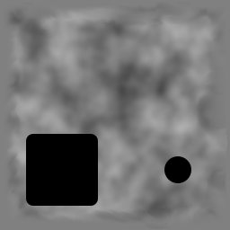

The darker the color is, R _ G _ B gets closer to zero, and thus the height is low. The whiter the color is, the height is high.

## Water

The simplest water is just a flat plane colored with blue. But that's boring. To make it more like water, we can add reflection and refraction textures. But how do we do that? We essentially need to draw the scene from different camera positions, and take a snap shot of the scene.

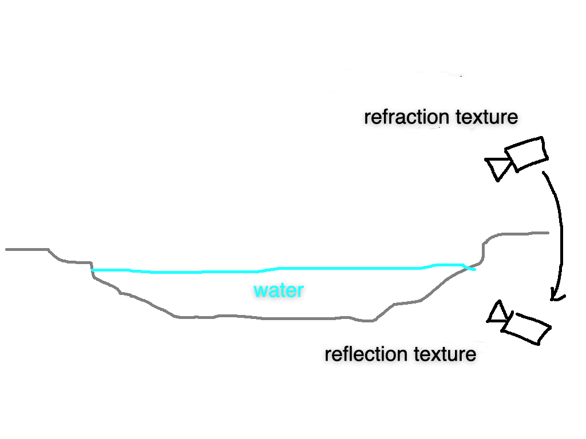

Now we can see reflection and refraction textures on the water. But no matter where the camera is, the ration of reflection and refraction looks the same. In reality, the water refracts more when we are on top of the water. The water reflects more when we are on the side.

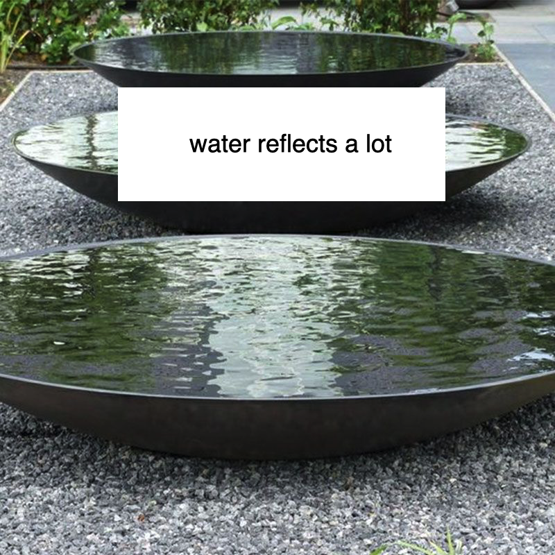

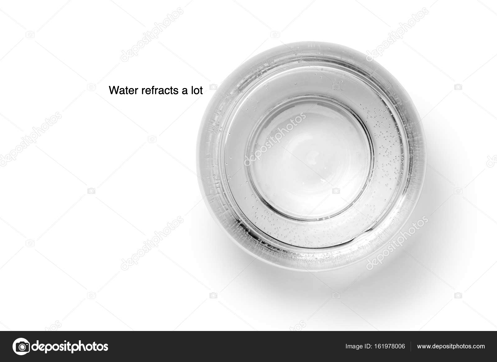

So we can do is to change the blending factor of the reflection texture and refraction texture based on the location of the camera. We can do that by taking the dot product between the water-to-camera vector and water-normal vector.

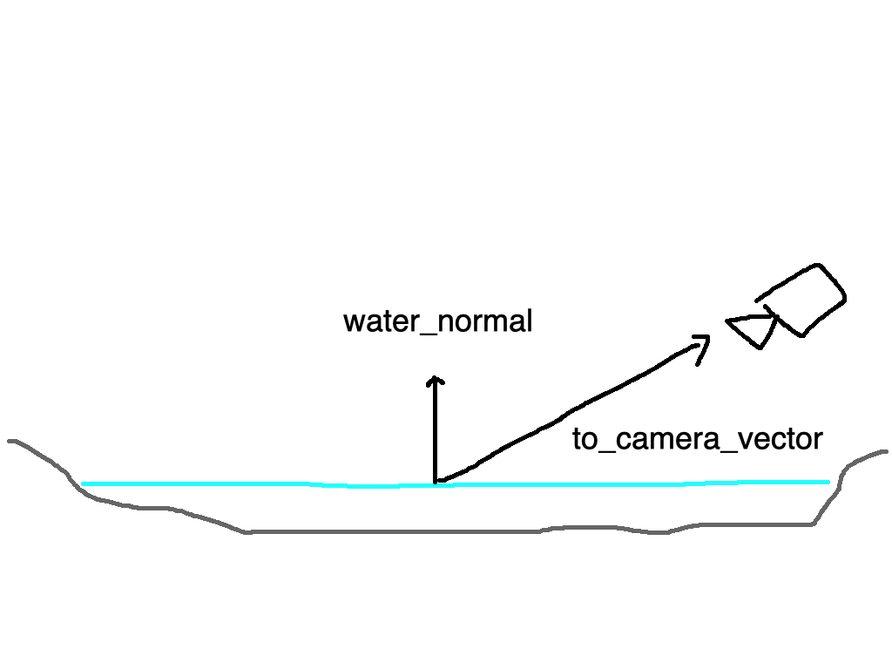

To make it even more real, we can add dudv map of the water. DuDv map stores directional information about how much we want to distort the texture.

The color of the dudv map is mostly red and green because red represent distoriton in x direction, and green represent distortion in y direction.

Finally we can apply normal map to the water to see diffuse and specular lighting.

## Mirror

Mirror works just like the water except there is no refraction and distortion. Just a pure reflection.

## Mouse Picking

The idea of mouse picking is that we want to convert 2D mouse coordinates back to 3D world coordinates.

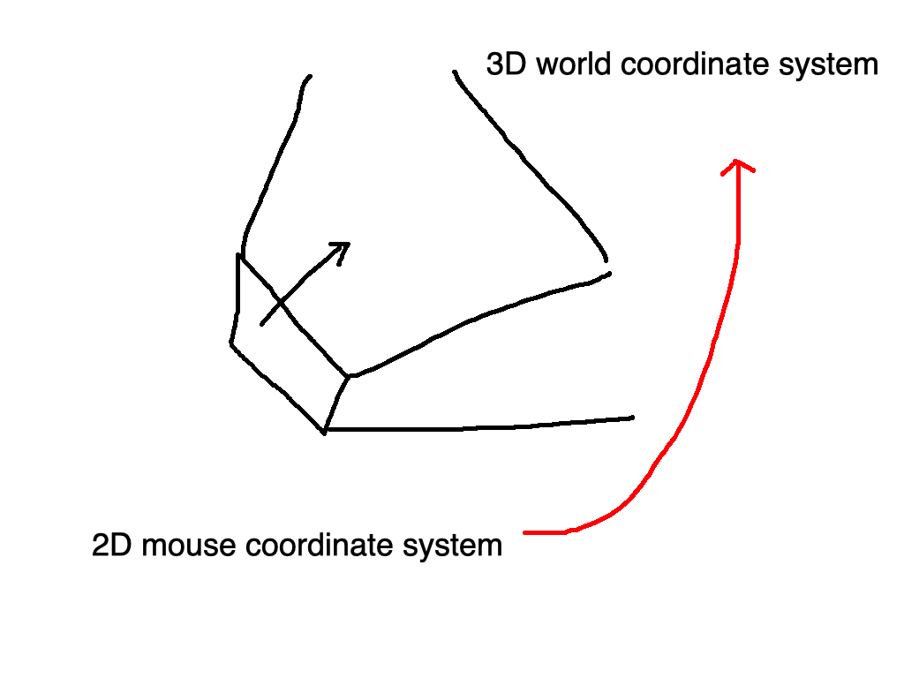

To do so, we will need to invert the whole graphics drawing pipeline to convert mouse coordinates into a ray vector that points from the location of the mouse to the scene.

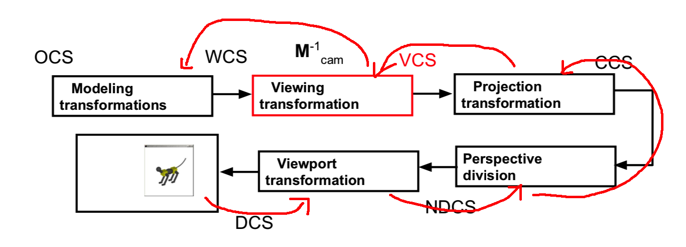

After we obtain the ray vector, we can calculate its intersection with sphere in the 3D scene.

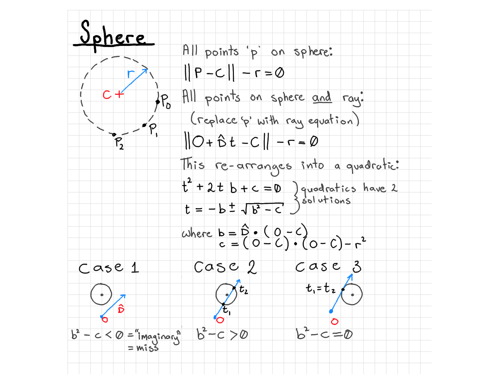

We approximated our lightbulbs as spheres and check it the ray intersects with a lightbulb.

## Particle Effects

A particle is really just a 2D square in a 3D scene. To make it look like it's in 3D scene, the particles have to always face towards the camera. To do this, we can simply apply model transform such that it cancels out the camera rotation. To animate the particle, we have to carefully choose the texture over the lifetime of the particle.

We can choose which texture we want to use by calculating the ratio of elapsted time of the particle and its life length. To achieve a smooth transtion from one texture to another, we can blend the current texture and next texture.  
## FireWork 
A firework is an interesting appliction that used the Particle effect from both the Partical and ParticalSystem class, such that each Firework object will have their own partical system that ueses a unique shape and texture. Featuredwise, in each frame the user will be able to fire some fireworks and oberserve the difference apperance of the fire work and color from
all kinds of angle.

## Modeling Light Bulb

We use the surface of revolution to model light bulbs by passing a list of vertices to the constructor.
We then make a rope to hang each light bulb by scaling a cube vertically.
Also, we create a variable called 'modifier' which changes the ambient value over time. When we draw each light bulb, we would use this 'modifier' to override of the color of the light bulb. Hence, when we draw a bunch of light bulbs at random locations with random colors, we would produce a lighting effect.

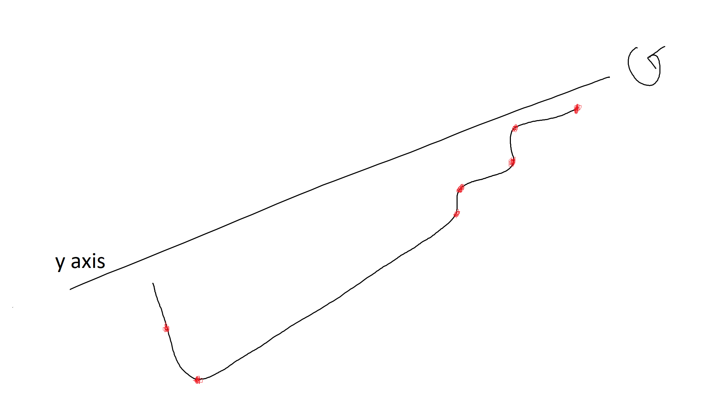
